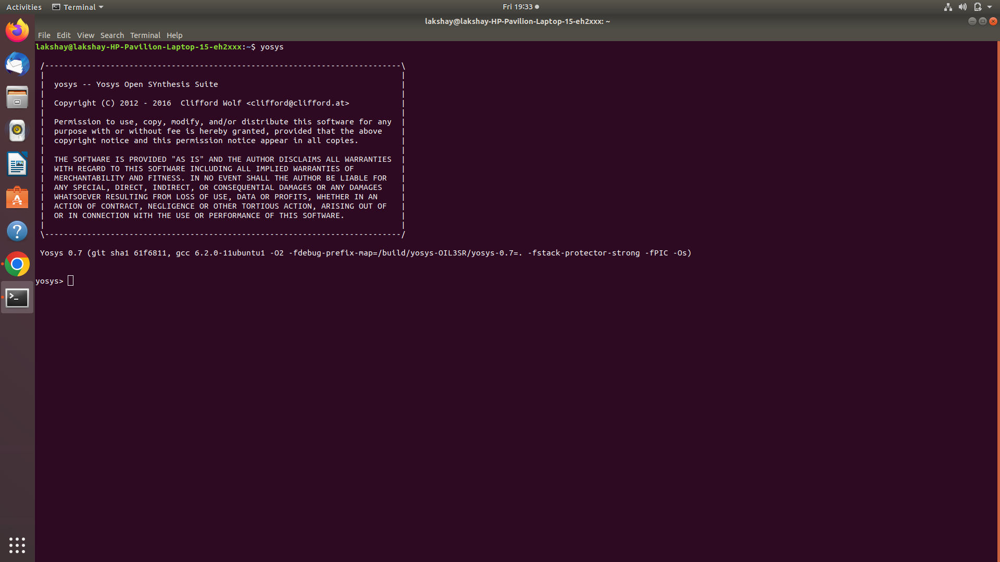
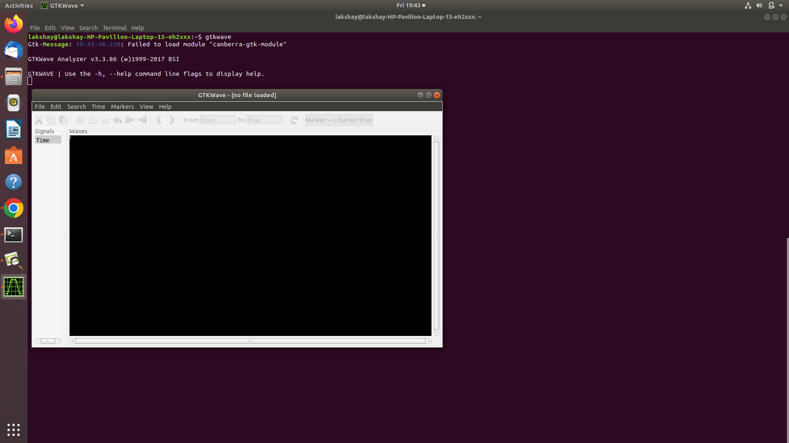

# DAY 0 (Introduction and Tools Installation)

##  Digital VLSI SOC Designing and Planning

Digital VLSI SoC design starts with specification and chip modeling, moves through RTL architecture, synthesis, and SoC integration, and culminates in RTL-to-GDSII physical design, ensuring the chip is manufacturable with the desired performance, power, and area goals.

1. **Chip Modeling & Specification**


        Define system requirements (performance, power, area, functionality).

        Create high-level models (C/SystemC/SpecC) to capture intended behavior.

        Partition design into IP blocks, cores, and interconnects.

2. **RTL Architecture & Design**


        Develop Register Transfer Level (RTL) description using Verilog/ SystemVerilog/VHDL.

        Define processor cores, memory subsystems, and custom accelerators.

        Ensure the design is synthesizable and modular.    


3.  **SoC Design Flow**

        Integrate multiple IPs (CPU, DSP, memory controllers, I/O, accelerators).

        Establish on-chip communication protocols (AXI, AHB, APB, etc.).

        Apply power planning (multi-voltage domains, clock gating) and  floorplanning considerations.

4. **ASIC Design Considerations**

        Target technology library selection (process node: 180nm → 3nm).

        Incorporate DFT (Design for Testability) features (scan chains, BIST).

        Plan for power, performance, area (PPA) trade-offs.

5. **Logic Synthesis**

        Convert RTL into a gate-level netlist using standard-cell libraries.

        Apply timing, area, and power constraints.

        Run Static Timing Analysis (STA) to ensure correct timing behavior.

6. **SoC Integration**

        Integrate synthesized IP blocks with interconnects and peripherals.

        Perform formal verification and equivalence checking between RTL and netlist.

        Verify low-power intent (UPF/CPF) and clock-domain crossings (CDC).

7. **RTL to GDSII (Physical Design Flow)**

        Floorplanning: Place major functional blocks on silicon.

        Placement: Arrange standard cells according to netlist.

        Clock Tree Synthesis (CTS): Distribute clocks with minimal skew.

        Routing: Connect all signals physically.

        Perform DRC (Design Rule Check) and LVS (Layout vs. Schematic) checks.

        Generate final GDSII file for tape-out.


## **YOSYS**


```bash
$ git clone https://github.com/YosysHQ/yosys.git
$ cd yosys 
$ sudo apt install make (If make is not installed please install it) 
$ sudo apt-get install build-essential clang bison flex \
    libreadline-dev gawk tcl-dev libffi-dev git \
    graphviz xdot pkg-config python3 libboost-system-dev \
    libboost-python-dev libboost-filesystem-dev zlib1g-dev
$ make 
$ sudo make install
```



## 
## **Iverilog**


```bash
$ sudo apt-get install iverilog
```


## **GTKWave**

```bash
$ sudo apt update
$ sudo apt install gtkwave
```



